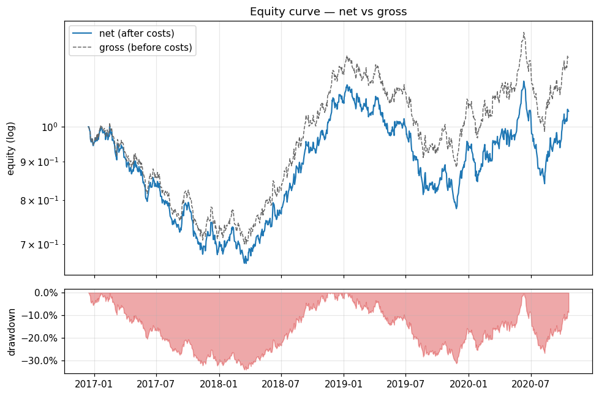
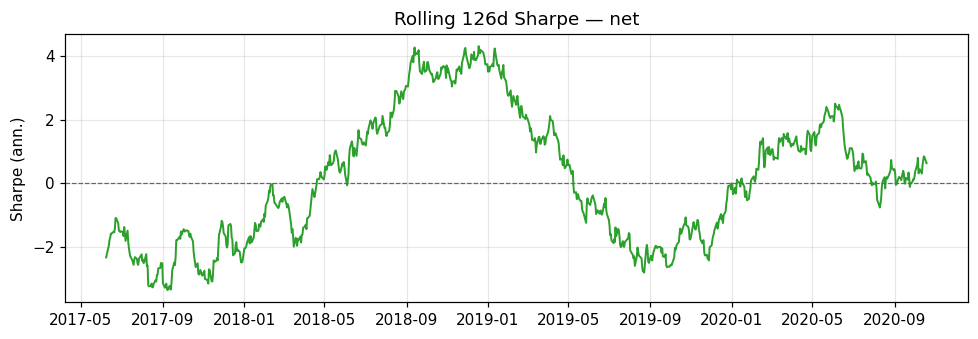
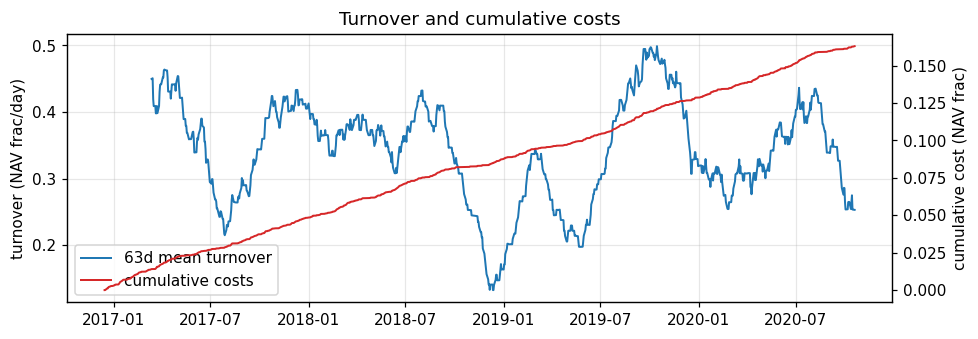

# synthetic_momentum_demo

Synthetic data demonstrate the research pipeline; these results are not evidence of investment performance. Charts and monthly returns cover 2016-12-15 through 2020-10-19. The training prefix before the first walk-forward test date is excluded. Partial months include only dates within this period.

## Key metrics

| metric | value |
| --- | --- |
| ann_return_net | 1.194% |
| ann_return_gross | 5.429% |
| ann_vol | 19% |
| sharpe_net | 0.1572 |
| sharpe_gross | 0.3732 |
| sharpe_se | 0.03156 |
| sortino | 0.2288 |
| max_drawdown | -34.09% |
| max_drawdown_peak | 2017-02-15T00:00:00 |
| max_drawdown_trough | 2018-03-21T00:00:00 |
| calmar | 0.03503 |
| hit_rate | 0.5065 |
| psr | 0.6232 |
| dsr | 0.6232 |
| n_trials | 1 |
| turnover_daily_mean | 0.3424 |
| turnover_ann | 86.28 |
| cost_drag_ann | 4.095% |
| n_days | 1003 |
| start | 2016-12-15T00:00:00 |
| end | 2020-10-19T00:00:00 |
| n_windows | 8 |
| mode | walkforward |

## Equity and drawdown

## Rolling 126d Sharpe

## Turnover and costs

## Monthly net returns

| year | Jan | Feb | Mar | Apr | May | Jun | Jul | Aug | Sep | Oct | Nov | Dec |
| --- | --- | --- | --- | --- | --- | --- | --- | --- | --- | --- | --- | --- |
| 2016 |  |  |  |  |  |  |  |  |  |  |  | -5.13% |
| 2017 | 4.09% | -3.77% | -4.03% | -3.15% | -8.37% | 3.13% | -5.06% | -7.00% | 5.40% | -9.54% | 3.13% | -5.76% |
| 2018 | 4.73% | -1.80% | -1.70% | 1.60% | 6.20% | 3.26% | 8.25% | 7.53% | 3.85% | 6.22% | 10.53% | -0.90% |
| 2019 | 0.69% | -2.13% | 0.14% | -4.37% | -2.34% | 0.74% | -9.48% | -8.11% | -1.66% | 1.06% | -2.66% | 15.11% |
| 2020 | -5.99% | 2.63% | 6.14% | 0.36% | 10.09% | -0.71% | -17.04% | 7.58% | 6.32% | 5.68% |  |  |

## Walk-forward windows

| # | train_start | train_end | test_start | test_end |
| --- | --- | --- | --- | --- |
| 1 | 2015-01-02 | 2016-12-07 | 2016-12-15 | 2017-06-08 |
| 2 | 2015-06-29 | 2017-06-01 | 2017-06-09 | 2017-12-01 |
| 3 | 2015-12-22 | 2017-11-24 | 2017-12-04 | 2018-05-28 |
| 4 | 2016-06-15 | 2018-05-21 | 2018-05-29 | 2018-11-20 |
| 5 | 2016-12-08 | 2018-11-13 | 2018-11-21 | 2019-05-15 |
| 6 | 2017-06-02 | 2019-05-08 | 2019-05-16 | 2019-11-07 |
| 7 | 2017-11-27 | 2019-10-31 | 2019-11-08 | 2020-05-01 |
| 8 | 2018-05-22 | 2020-04-24 | 2020-05-04 | 2020-10-19 |
